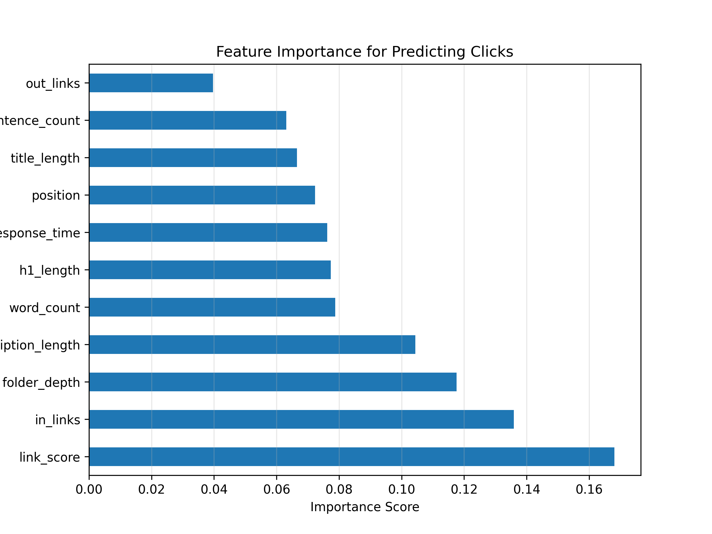
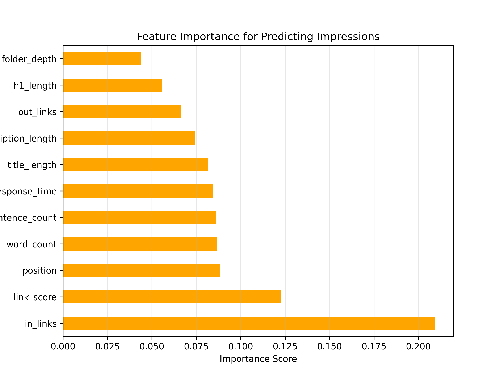

# SEO Performance Analysis & Optimization Strategy

This project analyzes search console data to uncover the SEO factors that most influence **clicks** and **impressions**. Using data cleaning, exploratory data analysis (EDA), visualizations, and statistical modeling, it identifies key drivers of performance and provides actionable recommendations.

---

## Project Goals
- Prepare and clean the SEO dataset
- Explore trends and patterns across performance metrics
- Identify the strongest factors influencing clicks and impressions
- Recommend strategies to boost search visibility and engagement

---

## Data Preparation
- Converted numeric columns (e.g., <code>position</code>, <code>bounce_rate</code>, <code>view_depth</code>, <code>response_time</code>) to floats  
- Removed irrelevant columns (<code>TimeSpent</code>, <code>RobotsVisits</code>, <code>Mobility</code>)  
- Standardized column names and handled missing values in <code>segments</code>  
- Rounded floats to two decimals and removed rows with >3 missing values  

---

## Exploratory Data Analysis
- Created <code>ctr</code> column: <code>(clicks / impressions) * 100</code>  
- Overall CTR: **1.79%**, Avg. position: **14** (below industry benchmark for positions 6–10)  
- Segment-level analysis revealed mid-range positions (6–9) often have high impressions but low CTR, signaling optimization opportunities  

---

## Key Findings
- <code>link_score</code> and <code>in_links</code> are the strongest predictors of both clicks and impressions  
- <code>position</code> significantly impacts visibility — higher rankings drive more impressions  
- Extremely long <code>word_count</code> and <code>title_length</code> don’t guarantee better performance  
- Deeper <code>folder_depth</code> and slower <code>response_time</code> hurt rankings and engagement  

---

##  Visual Insights

  

>
> **Figure: Feature Importance for Predicting Clickss**
> 
> This figure displays the feature importance scores from the regression model for predicting <code>clicks</code>. The analysis identifies <code>link_score</code> as the most influential factor, followed closely by <code>in_links</code> and <code>folder_depth</code>, indicating that backlink quality, backlink quantity, and site structure significantly impact click performance. <code>meta_description_length</code> and <code>word_count</code> also contribute moderately, while <code>out_links</code> has the least influence on driving clicks.
> 

  

>
> **Figure: Feature Importance for Predicting Impressions**
> 
> This figure illustrates the feature importance scores from the regression model for predicting <code>impressions</code>. The results show that <code>in_links</code> is the most influential factor, followed by <code>link_score</code> and <code>position</code>, indicating that backlink quantity, backlink quality, and search ranking position play the largest roles in determining visibility. Other features like <code>word_count</code>, <code>title_length</code>, and <code>response_time</code> have moderate impact, while <code>folder_depth</code> and <code>h1_length</code> contribute the least.

---

## Recommendations
1. **Boost backlink quality and quantity** — strengthen <code>link_score</code> and <code>in_links</code>  
2. **Improve snippets for mid-range positions** — optimize <code>title_length</code> and <code>meta_description_length</code> to lift CTR  
3. **Streamline site architecture** — reduce <code>folder_depth</code> and improve <code>response_time</code>  

---

## Tools
- **Python** (Pandas, NumPy, Scikit-learn, Matplotlib, Seaborn)  
- **Jupyter Notebook**  
- **SEO Metrics** (CTR, position, impressions analysis)  

---

## Repository Structure
├── data.csv # Cleaned dataset with SEO metrics for analysis
├── images/ # Folder containing project visualizations
│ ├── regression_clicks.png # Feature importance plot for predicting clicks
│ ├── regression_impressions.png # Feature importance plot for predicting impressions
│ └── ... # Additional plots from EDA and correlation analysis
├── README.md # Project overview, methodology, and navigation guide
└── seo_project_notebook.ipynb # Full Jupyter Notebook analysis workflow

---

##  Contact  
Sabrina McField  
📍 Atlanta, GA (Hybrid/Remote)  
✉️ sabrinamcfield@gmail.com  
🔗 [LinkedIn](https://www.linkedin.com/in/sabrinamcfield) | [GitHub](https://github.com/SabrinaMcField)

